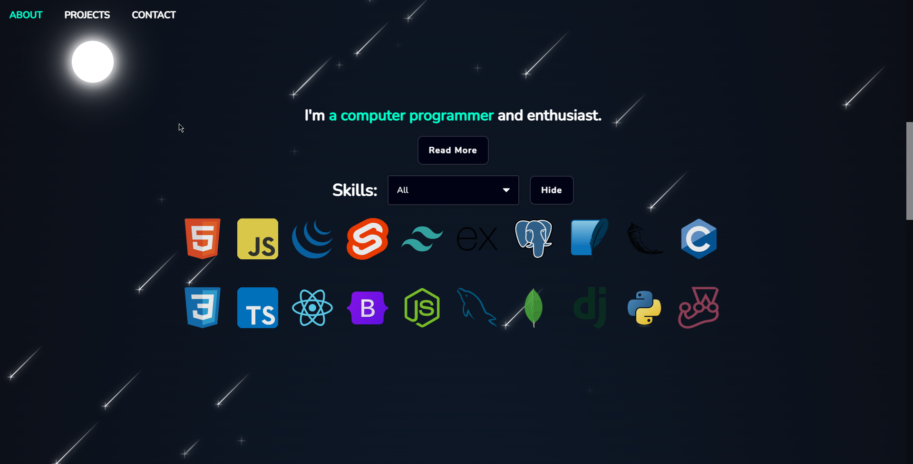
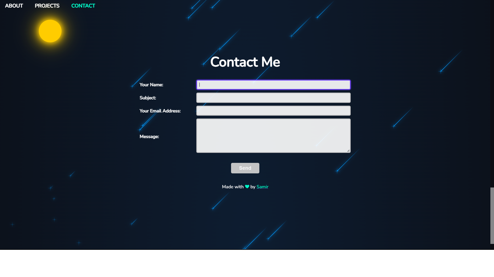
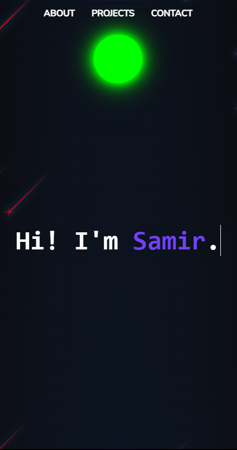
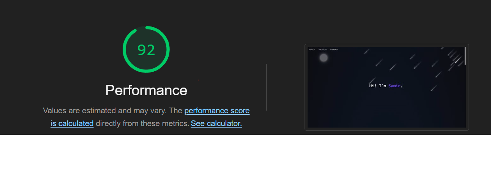

# Portfolio

### The front end of my portfolio website.

<table>
  <td align="center"><b>Frontend:</b></td>
  <td> 
    
    
    
    
    
  </td>
</table>
<table>
  <td align="center"><b>Backend:</b></td>
  <td> 
    
    
    
  </td>
</table>

## **Click on the pictures/the link below to try!**

## [Click to open](https://samirkabra.me)

## Features:

1. Includes all the basic elements: About me, My skills, My Projects, A and a form to contact me.
2. Lighthouse Performance score of 92
   
3. Works on all screen sizes, including mobile. (Tested on Chrome, Firefox, Safari, Edge, Opera, Brave)

## What I used/learned:

1. HTML/CSS: Multiple animations on different elements working concurrently. Allowing user to interact with the animations by manipulating the DOM. Scroll snapping.
2. Javascript: Making POST requests and rendering elements based on the response from the server.

### What I did well (I think):

1. Code is clean and modularized.
2. Webpage is aligned and styled proportionately, with minimalism in mind. Most of the elements are symmetrical. Sudden changes in layout are reduced to a minimum and animations are used to smoothen the transition.

### Problems I encountered:

1. Even though I planned out the layout of the website, I had to recreate it in a different environment even after nearing completion because it didnt have some functionalities that I wanted the website to have. I had to redo the layout and animations in a different environment. Just planning out the layout isnt enough, it is important that I have a working prototype of the website before I finalize the layout.

 

###### An exercise for [TheOdinProject](theodinproject.com)
